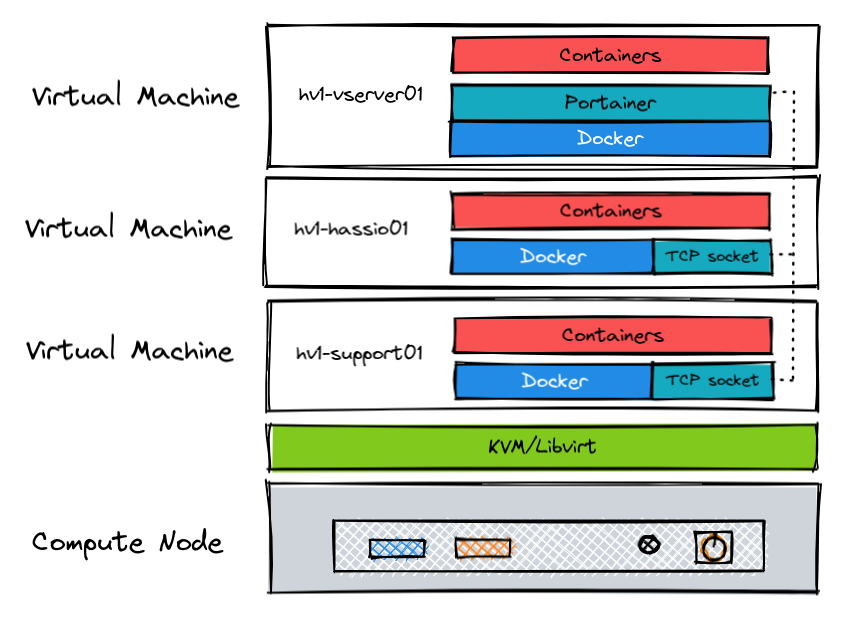

# My Home system - Base

This repo contains the IaC for my home system. It's based on KVM/libvirt VM(s). Applications are running in containers using the Docker runtime (for now). Application stacks (docker-compose) are being synchronized with git repository (home.apps) using Portainer.

## What's behind this

I tried to create an infrastructure for my home system to be as simple as possible but still to have some level of automation. Before i endedup with this simple design i was elaborating RKE2, K3s and Nomad... but since at work i am managing large K8s sclusters, to have a complex cluster also at home was my last intention (in addition to few hardware limitations).

## How it works

The IaC is located in the `code` directory. Most likely you will not need to change it. The directory `env` contains the variables for environments where you want to deploy this system. The content looks like this:

```sh
├── example               <<< # the name of the environment
│   ├── group_vars        <<< # group wars dir
│   │   └── all.yml       <<< # group wars file for all nodes
│   ├── hosts.ini         <<< # Ansible inventory file (will be generated during the run)
│   ├── backend.hcl       <<< # Terraform backend config (encrypted)
│   ├── secrets.tfvars    <<< # Terraform secret variables (encrypted)
│   └── terraform.tfvars  <<< # Terraform variables
```

> don't forget to export `ANSIBLE_VAULT_PASSWORD_FILE`

To deploy the system, run:

```sh
ansible-playbook -i env/example/hosts.ini site.yml --extra-vars "deployment=present"
```

To only configure the system, and do not tun `terraform apply` (but still it will run the `terraform plan`):

```sh
ansible-playbook -i env/example/hosts.ini site.yml --extra-vars "only_tf_plan=true"
``

To destroy the system, run:

```sh
ansible-playbook -i env/example/hosts.ini site.yml --extra-vars "deployment=absent"
```

To update Terraform cache, run:

```sh
ansible-playbook -i env/example/hosts.ini site.yml --tags decrypt
cd code/terraform/
terraform init -backend-config=../../env/example/decrypted.backend.hcl -reconfigure
```

Some facts:
- Secrets are encrypted using Ansible-vault (so you need to provide `--ask-vault-pass` option or `ANSIBLE_VAULT_PASSWORD_FILE` environment variable)
- I am using Terraform cloud to store the state file

## Deployment workflow


## Design



### Compute nodes

- Mini PCs
  - Prod - 4xCPU Intel i3, 8 GB RAM, 120GB SSD, 4TB external HDD, 60GB USB flash drive
  - Dev - 2xCPU Pentium-D, 8 GB RAM, 120GB SSD
- Ubuntu 20.04 LTS
- KVM/libvirt 4.0.0

## TO DO list

- Automated backup of heimdall, Home Assistant and Portainer configs
- Use the second compute node for dev environment
- CI/CD using Github Actions